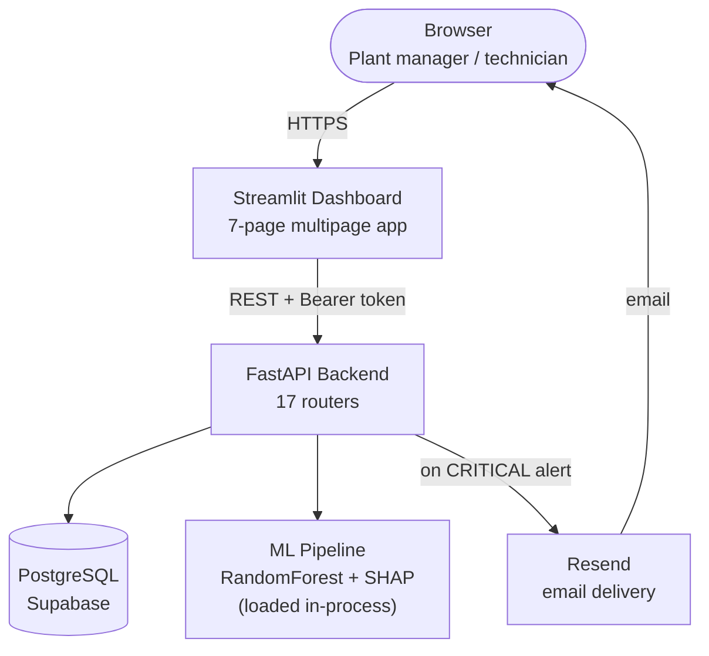
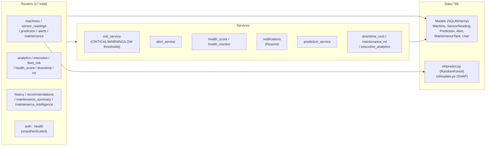
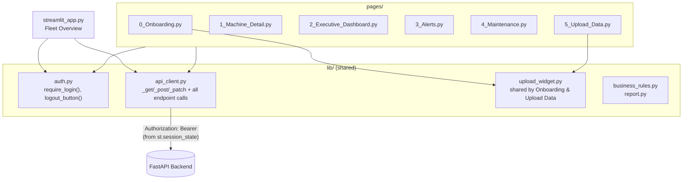
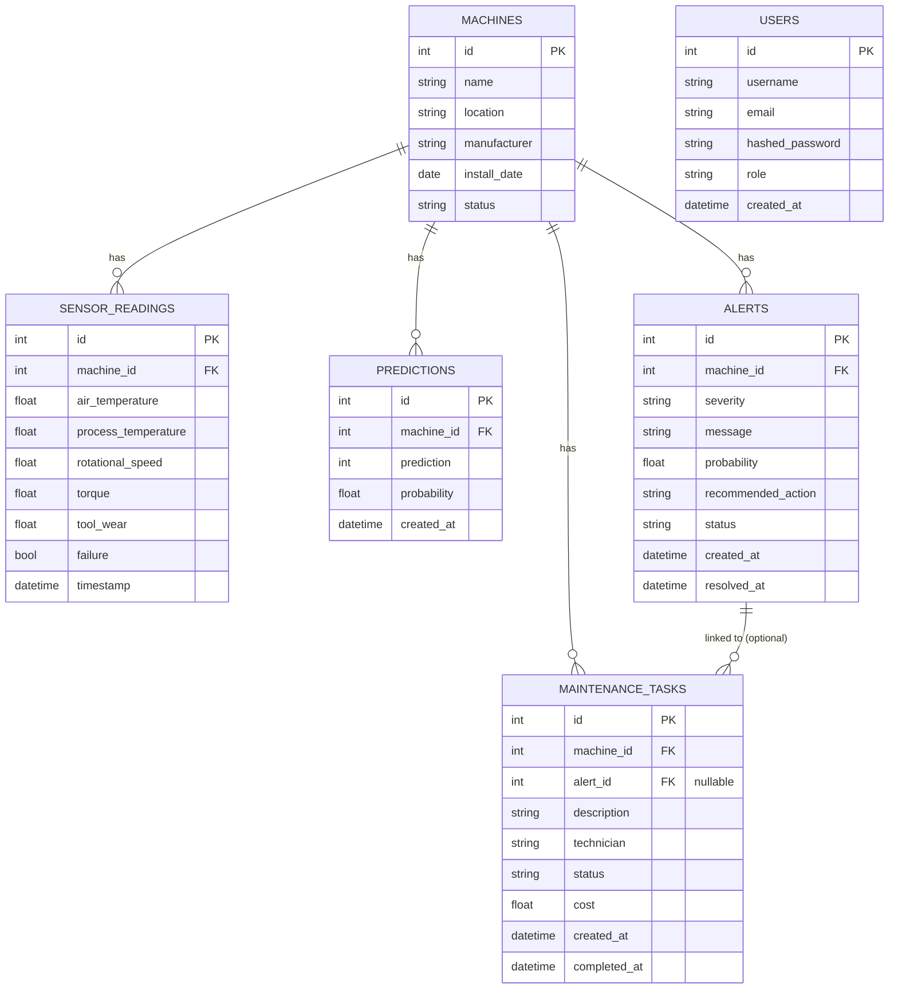
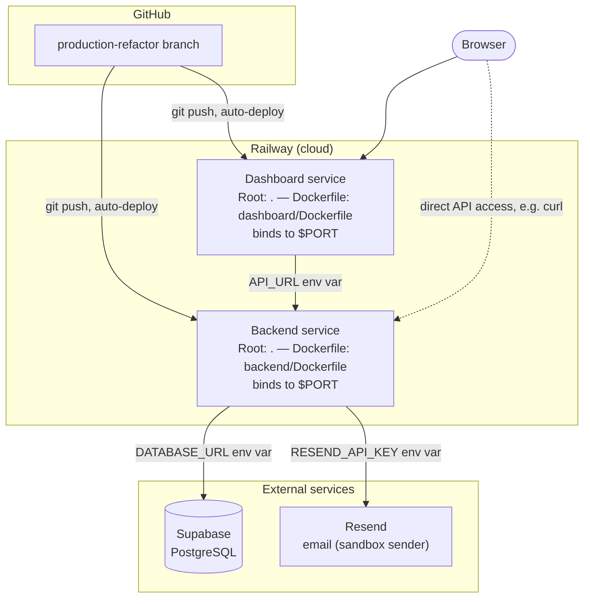

# System Architecture

**Last updated:** 2026-07-31 — reflects `production-refactor` as deployed.

---

## System Architecture

Three components: a Streamlit dashboard, a FastAPI backend, and a PostgreSQL database, plus two external services (an ML model loaded in-process and Resend for email).



The dashboard never talks to the database or the ML model directly — every read and write goes through the backend's REST API, authenticated with a bearer token held in Streamlit's session state.

---

## Backend Architecture

Layered: routers handle HTTP concerns and auth, services hold business logic, models are the SQLAlchemy ORM layer. The ML pipeline sits alongside the service layer and is invoked directly by `prediction.py`.



**Cross-cutting concerns:**
- **Auth** — applied once, at router-registration time in `main.py`, via `dependencies=[Depends(get_current_user)]` passed to `app.include_router(...)`. Every router is wrapped this way except `auth` and `health`.
- **Logging** — configured centrally in `core/logging_config.py`; a global exception handler in `main.py` logs unhandled errors and returns a generic 500 rather than leaking internals.
- **Config** — all environment-driven settings (`DATABASE_URL`, JWT settings, email settings, business-rule constants) live in `core/config.py`, read once at import time.

---

## Dashboard Architecture

Native Streamlit multipage app. `streamlit_app.py` is the entry point (Fleet Overview); everything else lives in `pages/`, ordered by filename prefix. Shared logic lives in `lib/`, not duplicated per page.



Every page calls `require_login()` immediately after `st.set_page_config(...)`; if there's no valid token in session state, the page renders only a login form and halts (`st.stop()`) before any of its own content runs.

---

## Database Schema

PostgreSQL, managed by Alembic (12 linear migrations, single head, no branches). `users` is intentionally disconnected from the rest of the schema — this is a single-tier auth model, not per-user data ownership.



**Migration history** (root → head): `create machines table` → `create sensor readings table` → `add failure label` (×2 passes) → `create users table` → `create alerts table` → `add alert status workflow` → `create maintenance tasks table` (×2 passes) → `update sensor readings for AI4I features` → `remove old sensor fields` → `create alerts, maintenance_tasks and predictions tables`. Current head: `23d19eb73305`.

Notable schema evolution: sensor reading columns were reworked mid-project to match the AI4I 2020 dataset's feature set (the five columns the ML model actually consumes today), and alerts gained a status workflow (`OPEN`/`RESOLVED`) and `resolved_at` timestamp after initial creation.

---

## API Structure

All routes are prefixed and grouped by domain; several routers (`machines`, `health`, `maintenance_summary`) share the `/machines` prefix rather than each owning a unique one.

| Domain | Prefix | Endpoints | Auth |
|---|---|---|---|
| Auth | `/auth` | `POST /login`, `GET /test` | Public |
| Machines | `/machines` | `POST /`, `GET /` | Required |
| Health Monitoring | `/machines` | `GET /{id}/health`, `GET /{id}/trend` | **Public today — see Known Issues** |
| Maintenance Summary | `/machines` | `GET /{id}/maintenance-summary` | Required |
| Sensor Readings | `/sensor_readings` | `POST /`, `GET /{machine_id}`, `GET /bulk/template`, `POST /bulk` | Required |
| Prediction | `/prediction` | `POST /`, `GET /machines/{id}`, `GET /history/{id}`, `GET /explanation` | Required |
| Alerts | `/alerts` | `GET /`, `PATCH /{id}/acknowledge`, `PATCH /{id}/resolve` | Required |
| Maintenance | `/maintenance` | `POST /`, `GET /`, `PATCH /{id}/start`, `PATCH /{id}/complete` | Required |
| Analytics | `/analytics` | `GET /summary`, `GET /machines/risk` | Required |
| Health Score | `/health-score` | `GET /machines/{id}` | Required |
| Downtime | `/downtime` | `GET /machines/{id}` | Required |
| Maintenance ROI | `/roi` | `GET /machines/{id}` | Required |
| Executive | `/executive` | `GET /summary` | Required |
| Fleet Risk | `/fleet-risk` | `GET /summary` | Required |
| History | `/history` | `GET /machines/{id}` | Required |
| Recommendations | `/recommendations` | `GET /machines/{id}` | Required |
| Maintenance Intelligence | `/maintenance-intelligence` | `GET /summary` | Required |
| — (root) | `/` | `GET /`, `GET /health` (liveness) | Public |

`POST /prediction/` is the only endpoint that writes to three tables in one call: it creates a `Prediction`, conditionally creates an `Alert` when risk is `CRITICAL`, conditionally auto-creates a `MaintenanceTask` from that alert, and — new this sprint — fires an email via `notifications.send_alert_email` when an alert was created. `POST /sensor_readings/bulk` deliberately does **not** trigger a prediction per row (would mean thousands of ML calls on a historical backfill); a single prediction is triggered once, afterward, against the latest reading.

---

## Authentication Flow

Single-customer, single-tier JWT auth (HS256, 24h expiry). No self-serve signup — users exist only via `backend/scripts/create_user.py`.

```mermaid
sequenceDiagram
    participant U as User (browser)
    participant D as Dashboard
    participant B as Backend
    participant DB as Postgres (users)

    U->>D: Enter username / password
    D->>B: POST /auth/login
    B->>DB: SELECT * FROM users WHERE username = ?
    DB-->>B: hashed_password
    B->>B: verify_password() — bcrypt compare
    alt valid credentials
        B->>B: create_access_token() — JWT, HS256, 24h
        B-->>D: 200 { access_token, token_type }
        D->>D: store token in st.session_state
    else invalid credentials
        B-->>D: 401 Unauthorized
    end

    Note over D,B: every later request attaches<br/>Authorization: Bearer &lt;token&gt;

    D->>B: GET /machines/  (+ Bearer token)
    B->>B: get_current_user dependency<br/>decodes JWT, checks expiry
    B->>DB: SELECT * FROM users WHERE username = sub
    DB-->>B: user row
    B-->>D: 200 { machines }
```

`get_current_user` is wired in once, at `main.py`'s `app.include_router(..., dependencies=_auth)` calls, rather than per-endpoint — which is also exactly how the `health.router` gap happened: it was left off that wiring because it was assumed to be the same thing as the standalone `/health` liveness route defined separately in `main.py`. It isn't — it's a distinct router containing real per-machine endpoints. See the engineering log's Known Issues for the fix.

---

## Deployment Architecture

Two independent Railway services built from the same GitHub repository and branch (`production-refactor` — not the repo's default branch), each auto-deploying on push.



Both Dockerfiles were rewritten this sprint to build from **repo-root context** rather than a subdirectory context — Railway's Dockerfile Path setting on this plan has no separate build-context override, so `dashboard/Dockerfile` originally failed to find `requirements.txt` until it was rewritten to reference `dashboard/requirements.txt` explicitly, matching how `backend/Dockerfile` already worked. `backend/start.sh` runs `alembic upgrade head` before starting Uvicorn on every deploy, so schema migrations apply automatically as part of the deploy, not as a separate manual step.

Local development uses the same two Dockerfiles via `docker-compose.yml`, against a disposable Postgres container instead of Supabase — the only difference is `DATABASE_URL` and the absence of Railway's `$PORT` (both services fall back to fixed ports 8000/8501 when it's unset).
